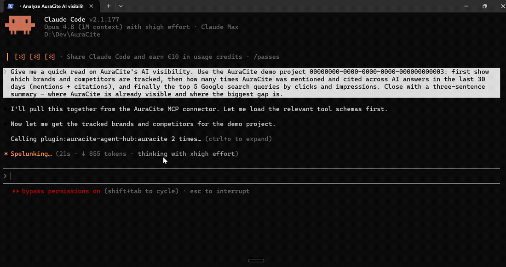

# AuraCite plugins for Claude Code

[](https://code.claude.com/docs/en/plugins)

This is the [Claude Code plugin marketplace](https://code.claude.com/docs/en/plugin-marketplaces)
for [**AuraCite**](https://auracite.de) — the AI-visibility / GEO platform that tracks how
ChatGPT, Gemini, and Perplexity mention, rank, cite, and recommend your brand.

## See it in action



One question in Claude Code → live data from three sources (tracked competitors, AI-engine mentions
& citations, Google Search demand) → one reasoned answer. ▶ **[Watch the 70-second demo](./media/auracite-agent-hub-demo-promo.mp4)**
— read-only, zero credits.

## Install

```text
/plugin marketplace add getauracite/claude-plugins
/plugin install auracite-agent-hub@auracite
```

Then run `/mcp` (or just ask a visibility question). Claude Code opens your browser, you sign in to
AuraCite once and approve, and you're connected. **No API key to paste.**

> Plugin details, alternative auth (API key), and the transport note are in
> [`auracite-agent-hub/README.md`](./auracite-agent-hub/README.md).

## Plugins in this marketplace

| Plugin | What it does |
| --- | --- |
| [`auracite-agent-hub`](./auracite-agent-hub) | Read-only MCP connector for AuraCite GEO data (brands, mentions, citations, share-of-voice, visibility score, competitors, trends, per-engine breakdown, brand comparison) plus Google Search Console performance (top queries, top pages, country/device, query trends), and the `ai-visibility` skill. |

## Security & scope

- Read-only `mcp:read` scope by default. Mutating and cost-bearing tools are hidden from this scope
  and gated behind separate explicit-approval flows in the AuraCite app (CostGuard, credits,
  idempotency, audit).
- The OAuth access token is a scoped, revocable AuraCite API key. Revoke any time in **API Keys →
  AuraCite app**.
- `tenant_id` / `project_id` are bound to your account server-side — a token holder can only read
  their own tenant's data.

## Validate locally

```bash
claude plugin validate .
claude plugin validate ./auracite-agent-hub
```

Never commit an API key, token, or secret into this repo or any plugin's `.mcp.json` — the
connector reads the OAuth token at runtime; an alternative static key is read from
`AURACITE_MCP_TOKEN`.

## License

Proprietary — © AuraCite (`LicenseRef-Proprietary`). Contact: [auracite.de](https://auracite.de).
