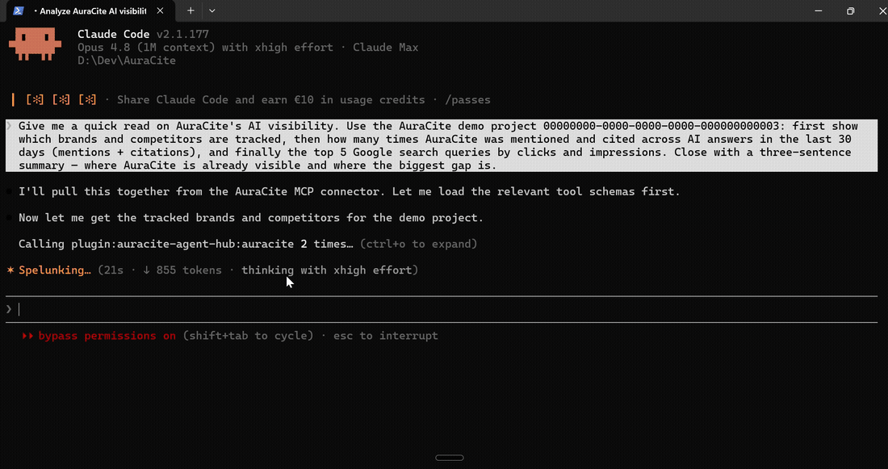

# AuraCite Agent Hub for Claude Code

Connect Claude Code to your [AuraCite](https://auracite.de) AI-visibility (GEO) data: see how ChatGPT, Gemini, Perplexity, and Claude mention, rank, cite, and recommend your brand, without leaving your editor.

The plugin reads measurement data. It does not write, scan, or spend by default: mutating and cost-bearing tools live behind separate scopes and an explicit approval chain in the AuraCite app (see Safety model).

## Install (one marketplace add, one install)

```text
/plugin marketplace add getauracite/claude-plugins
/plugin install auracite-agent-hub@auracite
```

## Quickstart

1. After installing, run `/mcp` or just ask a visibility question. The first tool call opens your browser to `auracite.de`.
2. Sign in and approve once. Claude Code stores a scoped, read-only token. No API key to paste.
3. Ask, for example: *"How is my brand doing in ChatGPT vs. Perplexity this month?"*

## What you get

- **MCP connector `auracite`** (read-only, `mcp:read`): tracked brands, AI mentions, citations of your pages as sources, share of voice, visibility score, competitors, trends, per-engine breakdown, brand comparison, AI-crawler access (which bots fetch which of your pages), and Google Search Console performance (top queries, per-page rows, country and device breakdowns, query trends).
- **Skill `ai-visibility`** (invoked as `/auracite-agent-hub:ai-visibility`): guides Claude to answer visibility questions from real AuraCite data instead of invented numbers.

## Safety model

- The connector runs with a read-only token. Mutating and cost-bearing tools are filtered out of `tools/list` server-side; the token cannot even see them.
- Writes require a separate `mcp:write` scope plus an approval chain (exact confirmation or a one-use approved retry, idempotency, audit events). Provider spend requires `mcp:spend`, a server-issued quote, hard credit caps, and CostGuard enforcement. None of this is part of the default connector.
- `tenant_id` and `project_id` are injected server-side from the verified token. A token holder can only read their own tenant's data.
- Tokens are short-lived and revocable from the AuraCite app at any time.

## Alternative: static API key

For CI, headless, or shared-machine setups, use a read-only key (`mcp:read`) created in the AuraCite app under API Keys, then set `.mcp.json` to:

```json
{
  "mcpServers": {
    "auracite": {
      "type": "http",
      "url": "https://auracite.de/mcp/rpc",
      "headers": { "X-API-Key": "${AURACITE_MCP_TOKEN}" }
    }
  }
}
```

Export the key, never commit it:

```bash
export AURACITE_MCP_TOKEN="gp_..."   # macOS/Linux
```

```powershell
$env:AURACITE_MCP_TOKEN = "gp_..."   # Windows PowerShell
```

## Demo



A real Claude Code session: one question, and the connector pulls live production data and reasons over it. Read-only, zero credits, zero provider cost.

Watch the [70-second demo](./media/auracite-agent-hub-demo-promo.mp4).

## Validate before publishing

```bash
claude plugin validate .
claude plugin validate ./auracite-agent-hub
```

Never commit an API key, token, or secret into this marketplace, the plugins, or their `.mcp.json`.

## Support and legal

- Website: https://auracite.de
- Support: hello@auracite.de
- Privacy: https://auracite.de/privacy · Terms: https://auracite.de/terms · Impressum: https://auracite.de/impressum

## License

Proprietary, (c) AuraCite (`LicenseRef-Proprietary`).
