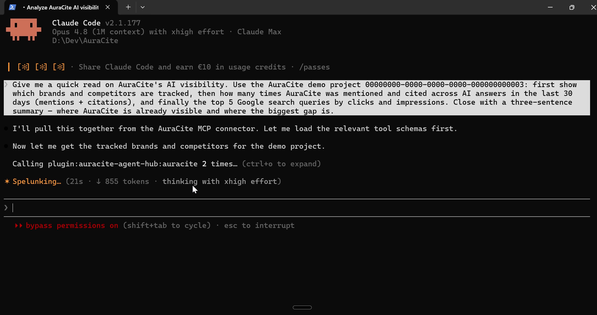
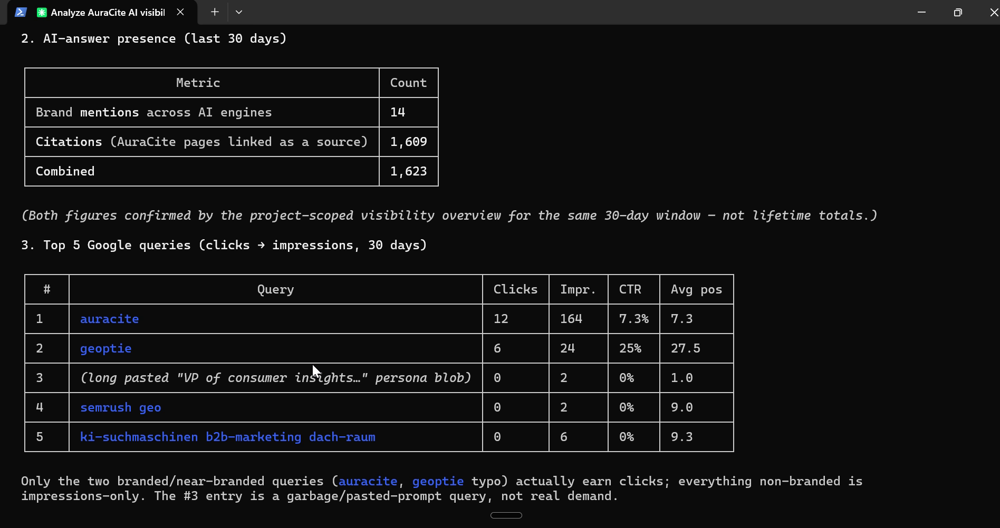
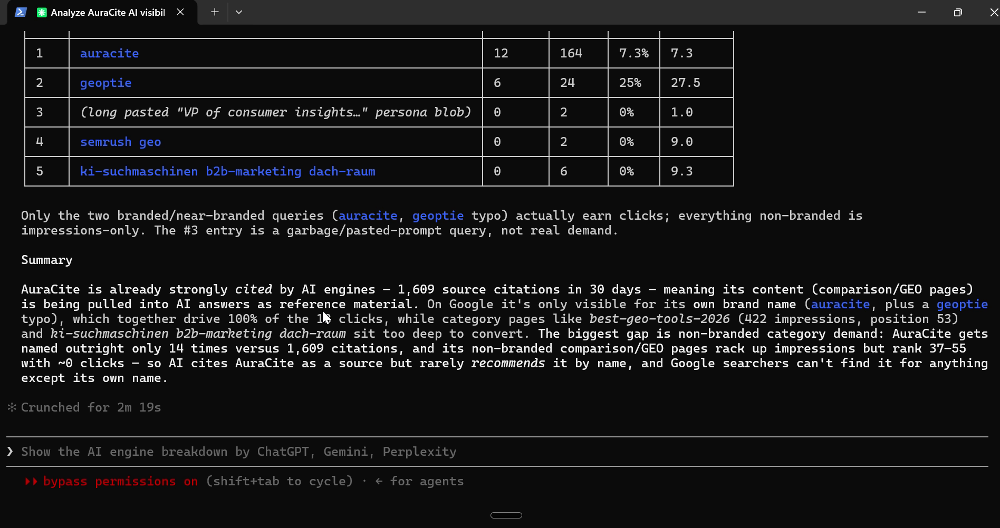

# AuraCite Agent Hub — Claude Code plugin

Connect Claude Code to your [AuraCite](https://auracite.de) AI-visibility (GEO) data: see how
ChatGPT, Gemini, and Perplexity mention, rank, cite, and recommend your brand — without leaving your
editor. Bundles the AuraCite MCP connector plus an `ai-visibility` skill.

## Install

```text
/plugin marketplace add getauracite/claude-plugins
/plugin install auracite-agent-hub@auracite
```

Then trigger any tool — e.g. `/mcp` or just ask *"How is my brand doing in ChatGPT vs. Perplexity
this month?"* Claude Code opens your browser, you sign in to AuraCite once and approve, and you're
connected. **No API key to paste.** The token is bound to your default project and inherits
AuraCite's rate limits, CostGuard, and revocation.

## What you get

- **MCP connector `auracite`** → read-only GEO tools: brands, mentions, citations, share-of-voice,
  visibility score, competitors, trends, per-engine breakdown, brand comparison.
- **Skill `ai-visibility`** (invoked as `/auracite-agent-hub:ai-visibility`) → guides Claude to
  answer visibility questions from real AuraCite data.

`tenant_id` and `project_id` are injected server-side from the token — a holder can only read their
own tenant's data. Mutating and cost-bearing tools are hidden from read-only access.

## Demo


A real Claude Code session: one question — *"how visible is AuraCite in AI answers?"* — and the
connector pulls live production data and reasons over it. In 30 days: **14 brand mentions** across AI
engines and **1,609 citations** (AuraCite pages cited as a source), tracked against BrightEdge,
Ahrefs, SEMrush, Profound and Otterly.ai — strongly cited, but the gap is non-branded category
demand. Read-only, zero credits, zero provider cost.

▶ **[Watch the 70-second demo](../media/auracite-agent-hub-demo-promo.mp4)**

<details>
<summary>Screenshots</summary>





</details>

## Alternative: static API key

Prefer not to use OAuth (CI, headless, shared machine)? Swap the connector to an API key. Create a
read-only key (`mcp:read`) in the AuraCite app under **API Keys** (admin-provisioned during the
pilot), then set `.mcp.json` to:

```json
{
  "mcpServers": {
    "auracite": {
      "type": "http",
      "url": "https://auracite.de/mcp/rpc",
      "headers": { "X-API-Key": "${AURACITE_MCP_TOKEN}" }
    }
  }
}
```

and export the key (never commit it):

```bash
export AURACITE_MCP_TOKEN="gp_..."   # macOS/Linux
```

```powershell
$env:AURACITE_MCP_TOKEN = "gp_..."   # Windows PowerShell
```

## Transport note (for maintainers)

`.mcp.json` uses Streamable HTTP (`type: http`) against `https://auracite.de/mcp/rpc` (JSON-RPC 2.0).
The endpoint advertises OAuth via `WWW-Authenticate` + `/.well-known/oauth-protected-resource`
(authorization-code + PKCE S256, dynamic client registration). If Claude Code's Streamable-HTTP
handshake ever doesn't negotiate cleanly, the legacy SSE transport is also live:

```json
{
  "mcpServers": {
    "auracite": {
      "type": "sse",
      "url": "https://auracite.de/mcp/sse",
      "headers": { "Authorization": "Bearer ${AURACITE_MCP_TOKEN}" }
    }
  }
}
```

## Local install (maintainers only)

From a clone of the AuraCite monorepo, with Claude Code launched at the repo root:

```text
/plugin marketplace add ./plugins/auracite-claude-marketplace
/plugin install auracite-agent-hub@auracite
```

## License

Proprietary — © AuraCite (`LicenseRef-Proprietary`). Contact: [auracite.de](https://auracite.de).
